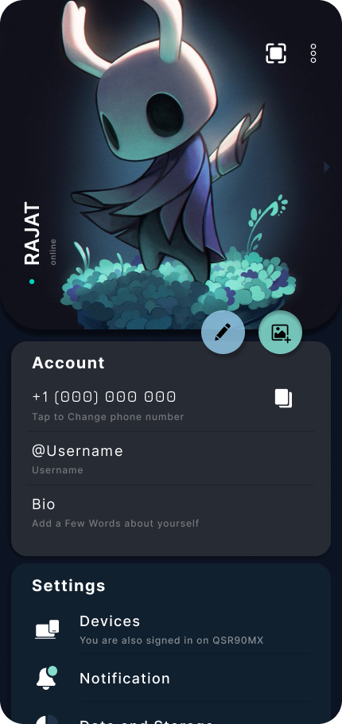

# 

## About 
>Based on 9.5.3

Love from 🇮🇳
- Reincarnation of Telegram, Telegram X, Nekogram, Nicegram 

## What's New:

- [x] New UI, Design from Scratch by [@Radioactive](https://github.com/Coolboyrajat)
- [x] Customizable widget in Action Bar;
- [x] Seperate Pinned Tabs;
- [x] Fingerprint Support for locking app;
- [x] Accent Color 🎨
- [x] Number of buttons under Profile Pic `[1,2 or 5 user dependent (min 1 required)]`
- [x] New Icon;
- [ ] Redesign Media Player;
- [ ] Swipe Control in media player;
- [ ] Delete Media data inside `Group/Channel` media tab and if `owner/admin` remove source chat.
- [x] Calender in Siderbar to remember Date (User based)
- [ ] Payment through QR code scanning;💡
- [x] N Many Many More tiny things can't be explained...😍🥳 Go for Prototype down below 👇🏻👇🏻

```
Note: Hi everyone the above points is what 
  I want to be integrated in the app,
     But Since I'm not a developer 
    I can't implement this feature.
```

## Demo Preview: <br>

### 👉🏼 [Click Here To View PROTOTYPE](https://www.figma.com/proto/4OuObhrp6NOdEuZ1c1UGBy/Telegram?node-id=645%3A74&scaling=min-zoom&page-id=0%3A1&starting-point-node-id=645%3A74) 👈🏼
>Duotone Icon with Color Palette

 <br>

> ⭐ Use ["Figma"](https://play.google.com/store/apps/details?id=com.figma.mirror&hl=en&gl=US&referrer=utm_source%3Dgoogle%26utm_medium%3Dorganic%26utm_term%3Dfigma+app&pcampaignid=APPU_1_ckfbY8zmHqeNseMP1-6YmAs&pli=1) app for Best outcomes.


## Features:

- [x] Profile Pic as background toggle (Source Nikogram, Telegram X)
- [x] Show either Phone Number or Unique ID or none (Source Nikogram)
- [x] More than 3+ Accounts (Source Telegram X)
- [x] Tablet Mode (Source Nikogram)
- [x] Clear Media data (Source Telegram X)
- [x] Go to Source Chat (Source Telegram X)
- [x] Pin Saved Messages (Source Telegram)
- [x] Scrolling Pin Messages (Source Telegram X)
- [x] Customize Double tap (Source )
- [x] Enable Quick Reaction (Source Telegram X)
- [x] Transparent Status Bar (Source Nikogram)
- [x] Emoji set (Source Telegram X)
- [x] Disable Jump to next Channel (Source Nikogram)
- [x] Multi-Select messages or media (Source Telegram X)
- [x] Bottom Action Bar (MDgram)

### Biometric FingerPrint Authentication (Java Based Code)

- activity_main.xml
```
android:id="@+id/main_layout"
android:visibility="gone"
```

- built.gradle
```
dependencies{
    implementation 'androidx.biometric:biometric:1.0.1'
}
```

- MainActivity.java
```
public class MainActivity extends AppCompatActivity {
    

   BiometricPrompt biometricPrompt; // Use androidx.biometric
   BiometricPrompt.PromptInfo promptInfo;
   ConstraintLayout mMainLayout;


   @Override
   protected void onCreate(Bundle savedInstanceState) {
       super.onCreate(savedInstanceState);
       setContentView(R.layout.activity_main);
       mMainLayout = findViewById(R.id.main_layout);


       BiometricManager biometricManager=BiometricManager.from(this);
       switch(biometric Manager.canAuthenticate())
       {
            case BiometricManager.BIOMETRIC_ERROR_NO_HARDWARE:
                Toast.makeText(getApplicationContext(), "Device Doesn't have fingerprint", Toast.LENGTH_SHORT).show();
                break;

            case BiometricManager.BIOMETRIC_ERROR_HW_UNAVAILABLE:
                Toast.makeText(getApplicationContext(), "Not Working", Toast.LENGTH_SHORT).show();

            case BiometricManager.BIOMETRIC ERROR_NONE_ENROLLED:
                Toast.makeText(getApplicationContext(), "No FingerPrint Assigned", Toast.LENGTH_SHORT).show();
       }

       
      Executor executor = ContextCompat.getMainExecutor(this);

      biometricPrompt = new BiometricPrompt(MainActivity.this, executor, new BiometricPrompt.AuthenticationCallback() {
            @Override
            public void onAuthenticationError(int errorCode, @NonNull CharSequence errString) {
                super.onAuthenticationError(errorCode, errString);
            }

            @Override
            public void onAuthenticationSucceeded(@NonNull BiometricPrompt.AuthenticationResult result) {
                super.onAuthenticationSucceeded(result);
                Toast.makeText(getApplicationContext()), "Login Successfully", Toast.LENGTH_SHORT.short();
                mMainLayout.setVisibility(view.VISIBLE);
            }

            @Override
            public void onAuthenticationFailed() {
                super.onAuthenticationFailed();
            }
        });

        promptInfo = new BiometricPrompt.PromptInfo.Builder()
                       .setTitle("Test Built")
                       .setDescription("Use FingerPrint to Login")
                       .setDeviceCredentialAllowed(true).built();

        biometricPrompt.authenticate(promptInfo);

   }  
}
```
<br>

- Any Ideas / Suggestion is appreciated. If you want to join the chat to discuss, suggest new ideas [Click Here](https://discord.gg/YqeTbs3Y)
- Check out how many of people voted for the features to be implemented [Poll]().
- Participate in the poll & see how many people like duotone icon in the demo preview [Poll]()
- See how many people use same version and as replacement of OG Telegram [Poll]()

<br>

### [YOU CAN CONTACT ME, IF YOUR ARE DEVELOPER AND TRY TO HELP ME BUILD THE APP.]()
[](https://discord.gg/YqeTbs3Y)
